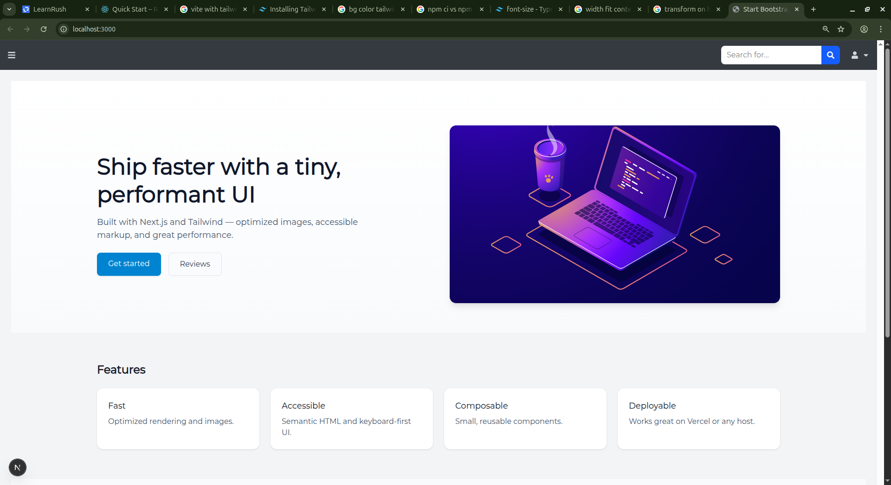
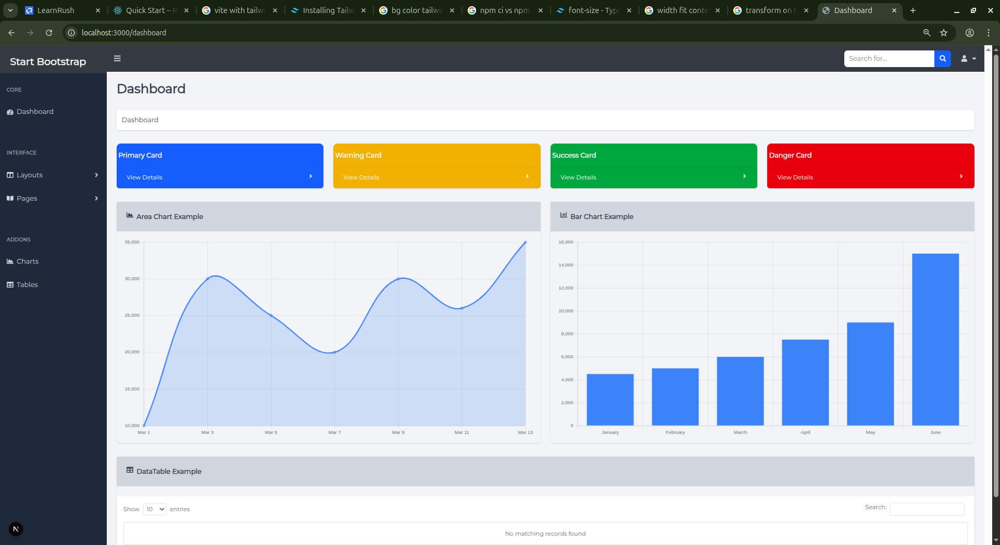
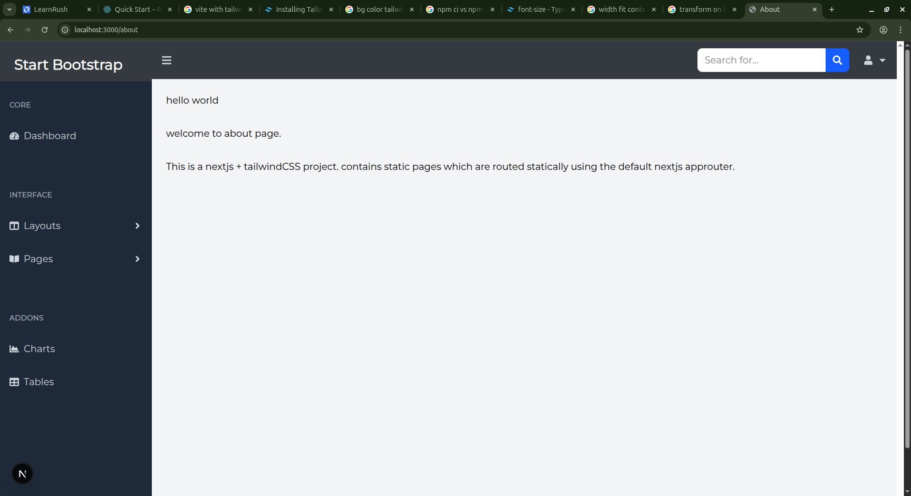
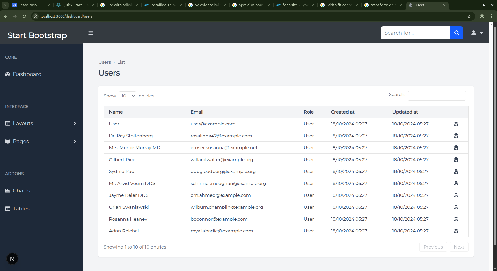
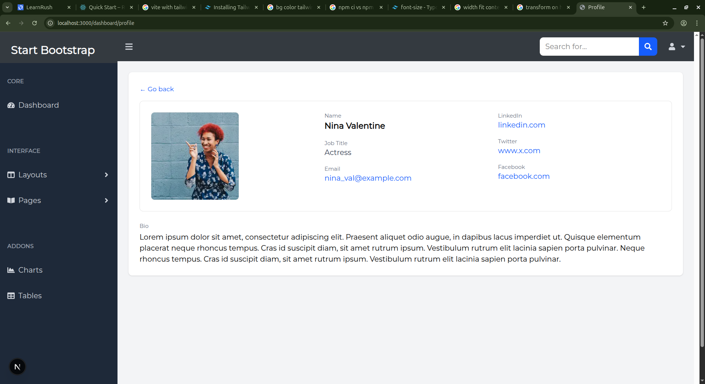
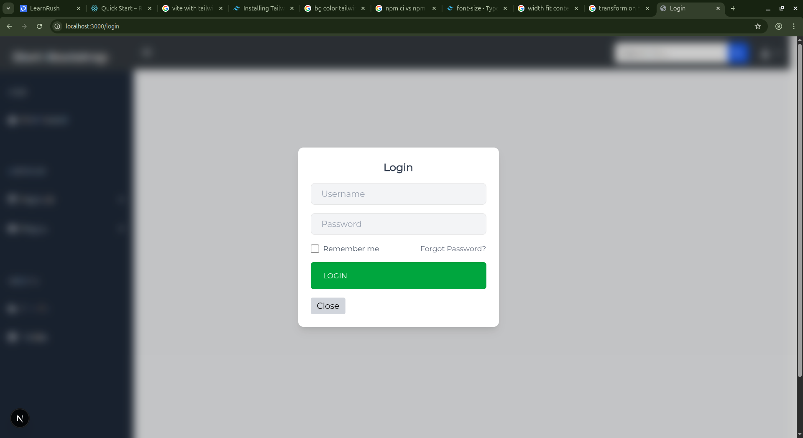

# **WEEK 3 Markdown File**

## ***Screenshots***
 ### **Landing Page**
 
 ### **Dashboard Page**
 
 ### **About Page**
 
 ### **Users Page**
 
 ### **Profile Page**
 
 ### **Login Page**
 

## ***Folder Structure***
    week3-next-tailwind-frontend/
    ├─ app/
    │  ├─ about/
    │  ├─ dashboard/
    │  │  ├─ profile/
    │  │  └─ users/
    │  └─ login/
    ├─ components/
    │  ├─ charts/
    │  ├─ landing/
    │  ├─ profile/
    │  └─ ui/
    ├─ public/
    │  └─ images/

## ***Components List***

### Chart Components
    Bar-chart.jsx
    Area-chart.jsx

### UI Components
    Badge.jsx
    Button.jsx
    Card.jsx
    Input.jsx
    Modal.jsx
    Navbar.jsx
    Search.jsx
    Sidebar.jsx
    Sidebar-group.jsx
    Sidebar-group-items.jsx
    Table.jsx
    User-menu.jsx

### Landing Components
    Hero.jsx
    Features.jsx
    Testimonials.jsx
    Footer.jsx

### Profile Component
    user-profile.jsx

## Lessons Learned
### 1. Creating a modular UI in a next js using Components
### 2. Understanding the advantages of using TailwindCSS over CSS in development perspective.
### 3. Understanding File system based routing implemented by App Router
### 4. Learning to implement nested routes in nextjs